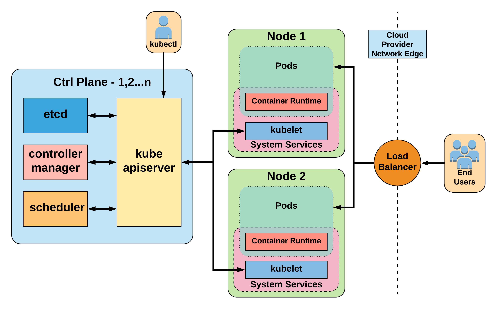

<!SLIDE>

# Networking Plugin

* **flannel**
* weave
* kube-router

### kubectl apply

    @@@ Console
    pi-images on  master [!] via 💎 v2.4.4
    ➜ wget https://raw.githubusercontent.com/coreos/flannel/v0.10.0/Documentation/kube-flannel.yml

    pi-images on  master [!] via 💎 v2.4.4
    ➜ vim kube-flannel.yml

    pi-images on  master [!] via 💎 v2.4.4
    ➜ kubectl apply -f kube-flannel.yml

<!SLIDE>

# Architecture

Source: github.com/mrbobbytables/diagrams
